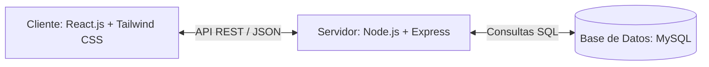

# Sistema de Horas Extra — GAD Municipal Cantón Sucúa — Plan de Implementación

Este plan describe la arquitectura técnica, la estructura de la base de datos y la organización del código para construir el sistema utilizando **React.js**, **Tailwind CSS**, **Node.js** y **MySQL**.

---

## 1. Arquitectura del Sistema

El sistema seguirá una arquitectura desacoplada Cliente-Servidor:



---

## 2. Base de Datos (MySQL Schema)

Diseñamos 3 tablas principales para cubrir las reglas de negocio e inmutabilidad:

### Tabla 1: `usuarios` (Autenticación del sistema)
- `id` (INT, Primary Key, Auto Increment)
- `username` (VARCHAR(50), Unique)
- `password_hash` (VARCHAR(255))
- `role` (ENUM('admin', 'autorizador', 'operador'))
- `estado` (BOOLEAN, Default True)

### Tabla 2: `funcionarios`
- `id` (INT, Primary Key, Auto Increment)
- `cedula` (VARCHAR(10), Unique, Indexed)
- `nombres_apellidos` (VARCHAR(150))
- `tipo` (ENUM('guardia', 'limpieza'))
- `rmu` (DECIMAL(10, 2)) - Remuneración Mensual Unificada
- `estado` (BOOLEAN, Default True)

### Tabla 3: `registro_horas_extra`
- `id` (INT, Primary Key, Auto Increment)
- `funcionario_id` (INT, Foreign Key -> `funcionarios.id`)
- `fecha` (DATE)
- `hora_inicio` (TIME)
- `hora_fin` (TIME)
- `tipo_jornada` (ENUM('suplementaria', 'extraordinaria'))
- `horas_calculadas` (DECIMAL(5, 2))
- `valor_calculado` (DECIMAL(10, 2)) - Con precisión de dos decimales
- `rmu_historico` (DECIMAL(10, 2)) - El salario del funcionario congelado en este registro
- `estado` (ENUM('pendiente', 'autorizado', 'rechazado'), Default 'pendiente')
- `autorizado_por` (INT, Foreign Key -> `usuarios.id`, Nullable)
- `fecha_autorizacion` (DATETIME, Nullable)

### Tabla 4: `feriados`
- `id` (INT, Primary Key, Auto Increment)
- `nombre` (VARCHAR(100))
- `fecha` (DATE, Unique)
- `recurrente` (BOOLEAN, Default False) - Indica si el feriado se repite anualmente (ignora el año al validar)
- `created_at` (TIMESTAMP)


### Tabla 5: `administrativos`
- `id` (INT, Primary Key, Auto Increment)
- `nombres_apellidos` (VARCHAR(150), Not Null)
- `cargo` (ENUM('director_administrativo', 'director_finanzas', 'administrador_bienes', 'jefe_recursos'), Not Null)
- `activo` (BOOLEAN, Default True)
- `created_at` (TIMESTAMP)

---


## 3. Backend (Node.js + Express)

Estructura de la API REST que expondrá los siguientes endpoints:

- **Autenticación:**
  - `POST /api/auth/login`
- **Funcionarios:**
  - `GET /api/funcionarios` (Listar activos/inactivos)
  - `POST /api/funcionarios` (Crear nuevo)
  - `PUT /api/funcionarios/:id` (Actualizar datos / RMU / Desactivar)
- **Horas Extra:**
  - `GET /api/horas-extra` (Listar registros con filtros de estado)
  - `POST /api/horas-extra` (Registrar y calcular automáticamente)
  - `PUT /api/horas-extra/:id/estado` (Autorizar o rechazar un registro)
  - `GET /api/horas-extra/reporte-mensual` (Obtener datos agrupados para el reporte)
- **Feriados:**
  - `GET /api/feriados` (Listar todos los feriados registrados)
  - `POST /api/feriados` (Crear nuevo feriado)
  - `DELETE /api/feriados/:id` (Eliminar un feriado registrado)
- **Administrativos:**
  - `GET /api/administrativos` (Listar todos los administrativos)
  - `POST /api/administrativos` (Registrar nuevo administrativo, deactivando anteriores del mismo cargo si se establece activo)
  - `PUT /api/administrativos/:id` (Actualizar datos o activar administrativo deactivando a otros del mismo cargo)
  - `DELETE /api/administrativos/:id` (Eliminar un administrativo)


### Lógica de Cálculo en el Servidor (Controladores):
Al recibir una petición de registro (`POST /api/horas-extra`):
1. Se recupera el `RMU` actual del funcionario.
2. Se calcula el valor de la hora ordinaria: `RMU / 240`.
3. Se calcula la duración de las horas trabajadas en base a `hora_inicio` y `hora_fin`.
4. Se aplica el factor según `tipo_jornada` (1.25 para suplementarias, 2.00 para extraordinarias).
5. **Cálculo Nocturno**: Se verifica si las horas caen dentro del rango de 19:00 a 06:00. Por cada hora dentro de este rango, se aplica un recargo del 25% (+0.25 al factor).
6. **Validación de Límites LOSEP**: Se realiza una consulta agregada para verificar que el funcionario no supere las 4 horas suplementarias al día, ni las 12 horas suplementarias en la semana correspondiente.
7. **Validación de Fecha Futura**: Se valida que la fecha del registro no sea posterior al día de hoy (fecha actual del servidor). Si la fecha es futura, la solicitud se rechaza con un error 400.


---

## 4. Frontend (React.js + Tailwind CSS)

### Estructura del Proyecto Frontend:
- `/src/components`: UI reutilizable (Tablas, Formularios, Selectores, Notificaciones Toast).
- `/src/pages`:
  - `Login`: Pantalla de inicio de sesión segura.
  - `Dashboard`: Panel principal con estadísticas de horas pendientes y autorizadas.
  - `Funcionarios`: Panel de administración para el personal.
  - `Feriados`: Vista para gestionar el calendario de feriados institucionales (Admin).
  - `RegistroHoras`: Formulario interactivo con cálculo automático en vivo y un componente de autocompletado interactivo (Searchable Dropdown) para filtrar personal por nombre o número de cédula en tiempo real.
  - `Aprobaciones`: Vista para que el rol 'autorizador' apruebe/rechace registros.
  - `Reportes`: Filtros por mes/año, vista de datos y botones de exportación (el formato PDF debe maquetar los bloques de firma para 'Elaborado por', 'Revisado por' y 'Autorizado por').
- `/src/services`: Conexiones API (Axios).
- `/src/utils`: Fórmulas matemáticas de validación de horas (Vitest para tests unitarios).

### Diseño Visual y Paleta de Colores (Tailwind CSS - GAD Sucúa):

Para elevar el nivel de la aplicación a una estética premium y gubernamental, implementaremos la identidad visual del **GAD Municipal del Cantón Sucúa** (Verde, Blanco, Amarillo):

- **Configuración de Tailwind (`tailwind.config.js`):**
  ```javascript
  theme: {
    extend: {
      colors: {
        sucua: {
          green: '#0F766E', // Verde esmeralda institucional (riqueza vegetal)
          yellow: '#F59E0B', // Amarillo cálido / Oro (riqueza del suelo)
          white: '#FFFFFF',  // Blanco puro (paz y transparencia)
          gray: '#F8FAFC',   // Fondo gris slate ultra claro
        }
      }
    }
  }
  ```

- **Características Visuales de Alta Calidad:**
  - **Glassmorphism:** Tarjetas de estadísticas en el Dashboard utilizando fondos traslúcidos con desenfoque (`bg-white/80 backdrop-blur-md border border-white/20`) y sombras suaves (`shadow-lg`).
  - **Visualizadores de Cálculo en Vivo:** Al digitar las horas en el formulario de registro, un indicador dinámico animado con gradiente (`from-sucua-green to-teal-600`) debe mostrar visualmente el desglose matemático en tiempo real (evitando recargas de página).
  - **Estados Visuales Claros:**
    - Registro Pendiente: Borde sutil amarillo (`border-sucua-yellow`) y badge en tono ámbar.
    - Registro Autorizado: Borde sutil verde (`border-sucua-green`) y badge verde.
  - **PDF de Reporte Premium:** Diseño optimizado para impresión con tipografía limpia (Inter / Roboto), tablas limpias con líneas grises muy finas, y los 3 bloques de firmas de responsabilidad al pie de página perfectamente alineados.

- **Usabilidad, Accesibilidad Básica y Diseño Adaptable (Totalmente Responsive):**
  - **Diseño Móvil y Tablet (Totalmente Responsive):** Uso estricto de la rejilla móvil de Tailwind (`grid-cols-1 md:grid-cols-3`). Las tablas complejas se transforman automáticamente en tarjetas individuales (`cards`) en teléfonos móviles para que no se corten lateralmente los datos del funcionario.
  - **Botones y Zonas Táctiles Amplias:** Todos los botones interactivos (como "Guardar" o "Autorizar") tendrán un área interactiva mínima de `44x44 píxeles` para que sean fáciles de pulsar con los dedos en teléfonos y tablets.
  - **Contraste Visual Elevado:** Colores de texto oscuro sobre fondos claros y viceversa para asegurar que el personal administrativo con vista cansada lea la información sin esfuerzo. Se evitará colocar texto blanco sobre el color amarillo institucional.
  - **Facilidad de Navegación (Teclado):** Formularios estructurados secuencialmente para que un operador de oficina pueda rellenar los datos rápidamente usando la tecla `Tab` para saltar de campo en campo.
  - **Mensajes Claros e Íconos:** Los estados (Autorizado, Pendiente, Rechazado) no dependerán solo del color verde o amarillo; irán acompañados de íconos explícitos (un check `✓` o un reloj `⏳`) y texto claro.

### 5. Especificaciones Técnicas del Dashboard Interactivo

Para implementar el panel de control de manera robusta y con alta performance, seguiremos el siguiente diseño técnico:

#### A. Procesamiento de Datos y Estados en Frontend:
* **Filtros en React State**:
  * `filtroTipo`: `'todos' | 'guardia' | 'limpieza'` (Filtra registros por el tipo de funcionario).
  * `filtroRango`: `'todos' | 'mes_actual' | 'mes_anterior' | 'ultimos_30_dias'` (Filtra registros por fecha).
  * `filtroEstado`: `'todos' | 'pendiente' | 'autorizado' | 'rechazado'` (Filtra registros por estado).
  * `filtroFuncionarioId`: `number | null` (Establece el filtro para la función de drill-down al hacer clic en el Top 5).
* **Cálculo Dinámico**:
  * Toda la agregación se realiza mediante `useMemo` en React para recalcular instantáneamente las métricas y los datasets de los gráficos cada vez que cambie un filtro, evitando llamadas redundantes a la API.

#### B. Arquitectura de Gráficos Nativos (SVG):
Para evitar conflictos de dependencias en React 19, implementamos gráficos personalizados 100% responsivos usando elementos nativos de SVG:
* **Dona Segmentada (Distribución de Horas/Monto)**:
  * Calculado usando las propiedades `strokeDasharray` y `strokeDashoffset` en círculos de SVG apilados.
  * Lógica matemática: `porcentaje = (valor / total) * 100`, `offset = circunferencia - (porcentaje / 100) * circunferencia`.
  * Estados `:hover` individuales y manejo de coordenadas del ratón para mostrar un tooltip flotante absolute con el desglose exacto (horas, recargos y valor).
* **Gráfico de Barras Verticales (Tendencia)**:
  * Dibujado con elementos `<rect>` posicionados proporcionalmente dentro de un contenedor SVG con viewBox.
  * Ejes X e Y escalados dinámicamente con base en el valor máximo del conjunto de datos filtrado.
  * Efecto hover con cambio de color y tooltip dinámico que muestra el mes/día y total acumulado.
* **Barra de Progreso Horizontal (Ranking Top 5)**:
  * Lista de los 5 funcionarios con más horas acumuladas.
  * Representado con barras HTML/Tailwind usando anchos porcentuales (`style={{ width: `${percent}%` }}`).
  * Evento `onClick` en la tarjeta o fila del funcionario para activar el drill-down, mutando `filtroFuncionarioId` e integrando un botón visual para "Limpiar filtro de funcionario".

